### 4 术语和定义
- 4.1 校正图形(Alignment Pattern)
> 用于确立矩阵符号位置的一个固定的参照图形,译码软件可以通过它在图像有中等程度损坏的情况下,再同步图像模块的坐标映像。

- 4.2 字符计数指示符(Character Count Indicator)
> 定义某一模式下的数据串长度的位序列

- 4.3 ECI指示符(ECI designator)
> 6位数字,用于标识具体的ECI任务

- 4.4 编码区域(encoding region)
> 在符号中没有被功能图形占用,可以对数据或纠错码字进行编码的区域

- 4.5 扩充解释(Extended Channel Interpretation(ECI))
> 在某些码制中,对输出数据流允许有与缺省字符集不同的解释的协议

- 4.6 扩展图形(Extended Pattern)
> 模式1中,不表示数据的一种功能图形

- 4.7 格式信息(Format Information)
> 一种功能图形,它包含符号使用的纠错等级以及使用的掩模图形的信息,以便对编码区域的剩余部分进行译码

- 4.8 功能图形(function pattern)
> 符号中用于符号定位与特征识别的特定图形

- 4.9 掩模图形参考(Mask Pattern Reference)
> 用于符号的三位掩模图形标识符

- 4.10 掩模(masking)
> 在编码区域内,用掩模图形对位进行XOR操作,其目的是使符号中深色与浅色模块数的比例均衡,并减少影响图像快速处理的图形出现

- 4.11 模式(mode)
> 将特定的字符集表示成位串的方法

- 4.12 模式指示符(Mode Indicator)
> 4位标识符,指示随后的数据序列所用的编码模式

- 4.13填充位(Padding Bit)
> 值为0,不表示数据,用于填充数据位流最后一个码字中终止符后面的空位

- 4.14 位置探测图形(Position Detection Pattern)
> 组成寻象图形的三个相同的图形之一

- 4.15 剩余位(Remainder Bit)
> 值为0,不表示数据,当编码区域不能正好被8位的码字填满时,用于填充最后一个码字后的空位

- 4.16 剩余码字(Remainder Codeword)
> 一种填充码字,当所有的数据码字和纠错码字不能正好填满符号的容量时,用于填充所空码字位置,它们紧跟在最后一个纠错码字之后

- 4.17 段(segment)
> 以同一ECI或编码模式编码的数据序列

- 4.18 分隔符(Separator)
> 全部由浅色模块组成的功能图形,宽度为一个模块,用于将位置探测图形与符号的其余部分分开

- 4.19 终止符(Terminator)
> 用于结束表示数据位流的位图0000

- 4.20 定位图形(Timing Pattern)
> 深色与浅色模块交错的图形,便于决定符号中模块的坐标

- 4.21 版本(Version)
> 用于表示符号规格的系列.某一特定版本是根据它在所允许的规格系列中的位置来确定的.QR码所允许规格系列为
> 21x21模块(版本1)~177x177模块(版本40).它也可以同时指示符号所应用的纠错等级

- 4.22 版本信息(Version Information)
> 在模式2符号中,包含符号版本的信息及该数据纠错位的功能图形

### 5 运算符
- div: 整除运算符
- mod: 整除后的余数
- XOR: 逻辑'异或'功能,当两个输入不等时,它的输出为1.其符号表示为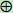

### 6 约定
- 6.1 坐标: (i,j)表示i行j列,(i、j均由0开始). 模块(0,0)表示符号中左上角的模块
- 6.2 字节: 字节内容用16进制表示
- 6.3 版本: 符号版本用版本V-E的方式表示,其中V表示版本号(1-40),E表示纠错等级(L,M,Q,H)

### 7 符号描述
> 本标准条款规定了QR码模式2符号的技术规范,除非在附录M中作特殊说明,否则也适用于模式1符号
- 7.1 基本特征
    > QR码为矩阵式二维码,具有如下特征:
    - a) 编码字符集
        - 1) 数字型数据(0~9)
        - 2) 字母数字型数据(数字0~9;大写字母A~Z;9个其他字符: space、$、%、*、+、-、.、/、:)
        - 3) 8位字节型数据(与JIS X 0201一致的JIS8位字符集(拉丁和假名))
        - 4) 日本汉字字符(与JIS X 0208 附录1:转换代码表示法一致的转化JIS字符集).
            > 注意：在QR码中的日本汉字字符的值为:0x8140-0x9FFC和0xE040-0xEBBF,可压缩为13位
        - 5) 中国汉字字符(与GB18030-2000 附录A 双字节字符表表示的字符集)
    - b) 数据表示法
        > 深色模块表示二进制1,浅色模块表示二进制0
    - c) 符号规格(不包括空白区)
        > 21x21模块到177x177模块(版本1到40,每版本符号每边增加4个模块)
    - d) 每个符号的数据字符数(最大规格的符号-版本40-L)
        - 1) 数字数据          7089个字符
        - 2) 字母数字字符       4296个字符
        - 3) 8位字节数据        2953个字符
        - 4) 日本汉字数据       1817个字符
        - 5) 中国汉字数据       21008个字符(数据应有误,未经考证)
    - e) 纠错的选择
        > 4种纠错等级,可恢复的码字节比例为:
        > * L     7%
        > * M     15%
        > * Q     25%
        > * H     30%
    - f) 符号类型:矩阵
    - g) 独立定位:是
        > 图1为QR码符号版本1的示例

- 7.2 其他特征综述
    > 以下QR码特征有些是固有的,有些是可选的:
    - a) 结构链接(可选)
        > 允许把数据文件用最多16个QR码符号在逻辑上连续地表示.它们可以以任意的顺序扫描,而原始数据能正确地重新连接起来
    - b) 掩模(固有)
        > 可以使符号中深色与浅色模块的比例接近1:1,使因相邻模块的排列造成译码困难的可能性降为最小
    - c) 扩充解释(可选)
        > 这种方式使符号可以表示缺省字符集以外的数据(如阿拉伯字符、古斯拉夫字符、希腊字母等),以及其他解释(如用一定的压缩方式表示的数据)
        > 或者对行业特点的需要进行编码
- 7.3 符号结构
    > 每个QR码符号由名义上的正方形模块组成。组成一个正方形阵列,它由编码区域和包括寻象图形、分隔符、定位图形和
    > 校正图形在内的功能图形组成.功能图形不能用于数据编码.符号的四周由空白区包围.图2为QR码版本7符号的结构图
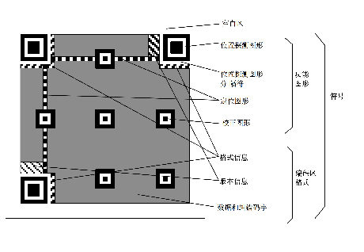

    - 7.3.1 符号版本和规格
        > QR码符号共有40种规格,分别为版本1、...、版本40.版本1的规格为21x21模块,版本2为25x25,以此类推,每一版本比上一版本每边增加4个模块,直到版本40,
        > 规格为177x177模块.图3至8为版本1、2、6、7、14、21和40的符号结构.
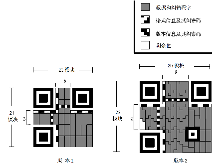
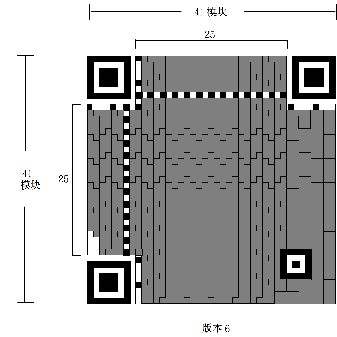
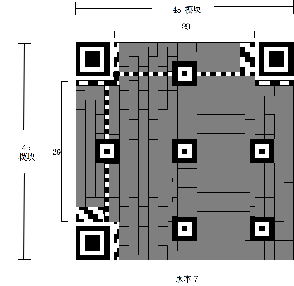
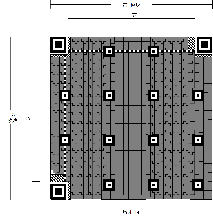
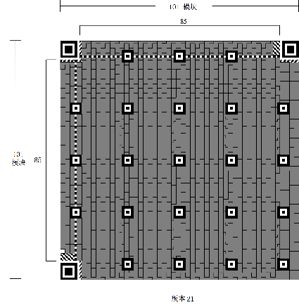
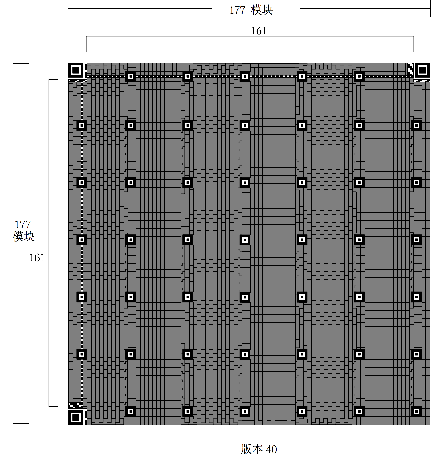

    - 7.3.2 寻象图形
        > 寻象图形包括三个相同的位置探测图形,分别位于符号的左上角、右上角、左下角,如图2所示.
        > 每个位置探测图形可以看作是由3个重叠的同心的正方形组成,他们分别是7x7个深色模块、5x5个浅色模块和3x3个深色模块。
        > 如图9所示,位置探测图形的模块宽度比为1:1:3:1:1. 符号中其他地方遇到类似图形的可能性极小,因此可以在视场中迅速地
        > 识别可能的QR码符号. 识别组成寻象图形的三个位置探测图形,可以明确地确定视场中符号的位置和方向.
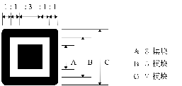

    - 7.3.3 分隔符
        > 在每个位置探测图形和编码区域之间有宽度为1个模块的分隔符,如图2所示,它全部由浅色模块组成.
    - 7.3.4 定位图形
        > 水平和垂直定位图形分别为一个模块宽度的一行和一列,由深色浅色模块交替组成,其开始和结尾均是深色模块.
        > 水平定位图形位于上部的两个位置探测图形之间,符号的第6行.
        > 垂直定位图形位于左侧的两个位置探测图形之间,符号的第6列.
        > 它们的作用是确定符号的密度和版本,提供决定模块坐标的基准位置.
    - 7.3.5 校正图形
        > 每个校正图形可以看作是3个重叠的同心正方形,由5x5个的深色模块,3x3个的浅色模块以及位于中心的一个深色模块组成.
        > 校正图形的数量视符号的版本号而定,在模式2的符号中,版本2以上(含版本2)的符号均有校正图形,详见附录E.
    - 7.3.6 编码区域
        > 编码区域包括表示数据码字、纠错码字、版本信息和格式信息的符号字样.符号字符的详细内容参见8.7.1,
        > 格式信息的详细内容见8.9,版本信息的详细内容见8.10.
    - 7.3.7 空白区
        > 空百度为环绕在符号四周的4个模块宽的区域,其反射率应与浅色模块相同
### 8 要求
- 8.1 编码方法综述
> - 第一步 数据分析
> 
> 分析所输入的数据流,确定要进行编码的字符的类型.QR码支持扩充解释,可以对与缺省的字符集不同的数据进行编码.QR码包括
> 几种不同的模式(见8.3),以便高效地将不同的字符子集转换为符号字符.必要时可以进行模式之间的转换以便更高效地将数据转换
> 为二进制串。
>
> 选择所需的错误检测和纠正等级.如果用户没有指定所采用的符号版本,则选择与数据相适应的最小的版本.表1为全部符号版本及其容量。
> 表1  QR码各版本符号的数据容量
| 版本 | 每边的模块数(A) | 功能图形模块数(B) | 格式及版本信息模块数(C) | 除C以外的数据模块数(D=A^2-B-C) | 数据容量"码字"(E) | 剩余位 |
| ---- | --------------- | ----------------- | ----------------------- | ------------------------------ | ----------------- | ------ |
| 1    | 21              | 202               | 31                      | 208                            | 26                | 0      |
| 2    | 25              | 235               | 31                      | 359                            | 44                | 7      |
| 3    | 29              | 243               | 31                      | 567                            | 70                | 7      |
| 4    | 33              | 251               | 31                      | 807                            | 100               | 7      |
| 5    | 37              | 259               | 31                      | 1079                           | 134               | 7      |
| 6    | 41              | 267               | 31                      | 1383                           | 172               | 7      |
| 7    | 45              | 390               | 67                      | 1568                           | 196               | 0      |
| 8    | 49              | 398               | 67                      | 1936                           | 242               | 0      |
| 9    | 53              | 406               | 67                      | 2336                           | 292               | 0      |
| 10   | 57              | 414               | 67                      | 2768                           | 346               | 0      |
| 11   | 61              | 422               | 67                      | 3232                           | 404               | 0      |
| 12   | 65              | 430               | 67                      | 3728                           | 466               | 0      |
| 13   | 69              | 438               | 67                      | 4256                           | 532               | 0      |
| 14   | 73              | 611               | 67                      | 4651                           | 581               | 3      |
| 15   | 77              | 619               | 67                      | 5243                           | 655               | 3      |
| 16   | 81              | 627               | 67                      | 5867                           | 733               | 3      |
| 17   | 85              | 635               | 67                      | 6523                           | 815               | 3      |
| 18   | 89              | 643               | 67                      | 7211                           | 901               | 3      |
| 19   | 93              | 651               | 67                      | 7931                           | 991               | 3      |
| 20   | 97              | 659               | 67                      | 8683                           | 1085              | 3      |
| 21   | 101             | 882               | 67                      | 9252                           | 1156              | 4      |
| 22   | 105             | 890               | 67                      | 10068                          | 1258              | 4      |
| 23   | 109             | 898               | 67                      | 10916                          | 1364              | 4      |
| 24   | 113             | 906               | 67                      | 11796                          | 1474              | 4      |
| 25   | 117             | 914               | 67                      | 12708                          | 1588              | 4      |
| 26   | 121             | 922               | 67                      | 13652                          | 1706              | 4      |
| 27   | 125             | 930               | 67                      | 14628                          | 1828              | 4      |
| 28   | 129             | 1203              | 67                      | 15371                          | 1921              | 3      |
| 29   | 133             | 1211              | 67                      | 16411                          | 2051              | 3      |
| 30   | 137             | 1219              | 67                      | 17483                          | 2185              | 3      |
| 31   | 141             | 1227              | 67                      | 18587                          | 2323              | 3      |
| 32   | 145             | 1235              | 67                      | 19723                          | 2465              | 3      |
| 33   | 149             | 1243              | 67                      | 20891                          | 2611              | 3      |
| 34   | 153             | 1251              | 67                      | 22091                          | 2761              | 3      |
| 35   | 157             | 1574              | 67                      | 23008                          | 2876              | 0      |
| 36   | 161             | 1582              | 67                      | 24272                          | 3034              | 0      |
| 37   | 165             | 1590              | 67                      | 25568                          | 3196              | 0      |
| 38   | 169             | 1598              | 67                      | 26896                          | 3362              | 0      |
| 39   | 173             | 1606              | 67                      | 28256                          | 3532              | 0      |
| 40   | 177             | 1614              | 67                      | 29648                          | 3706              | 0      |
> 注: 码字长度为8位

> - 第二步 数据编码
> 
> 对于采用的模式按照8.4.1至8.4.5所定义的规则,将数据字符转换为位流.在当需要进行模式转换时,在新的模式段开始前加入模式
> 指示符进行模式转换.在数据序列后面加入终止符.将产生的位流分为每8位一个码字.必要时加入填充字符以填满按照版本要求的数据码字数.
>
> - 第三步 纠错编码
>
> 按需要将码字序列分块(见表13~22),以便按块生成相应的纠错码字,并将其加入到相应的数据码字序列的后面
>
> - 第四步 构造最终信息
>
> 按8.6节(第三步)的描述,在每一块中置入数据和纠错码字,必要时加剩余位.
>
> - 第五步 在矩阵中布置模块
>
> 将寻象图形、分隔符、定位图形、校正图形与码字模块一起放入矩阵.
>
> - 第六步 掩模
>
> 依次将掩模图形用于符号的编码区域.评价结果,并选择其中使深色浅色模块比率最右且使不希望出现的图形最少化的结果.
>
> - 第七步 格式和版本信息
>
> 生成格式和版本信息(如果用到时),形成符号.

- 8.2 数据分析
> 分析输入数据,确定其内容并且选择采用缺省的或者其它适当的ECI以及适当的模式,
> 对每个序列编码,其详细描述见8.4.从数字模式到日本汉字模式,每种模式的字符所需
> 的位数依次增加.在符号中可以通过模式的转换使数据的位流长度最短,部分数据用一种模式
> 编码可以比其他部分的编码效率更高.例如: 数字序列后跟随字母数字序列.理论上说,用
> 每个数据字符所需的位数最少的模式进行编码是最高效的,但每次模式转换时都需要有相关
> 模式指示符和字符数量指示符等形式的附加开销,因此,对于较少的字符数,模式的转换并
> 不总是能使位流总量最少,有关这方面的说明见附录H.同时,由于各个版本的容量的增加
> 是步进的,所以不一定在任何情况下都要达到最高的转换效率.

- 8.3 模式
    > 下列模式是根据缺省的ECI有关的字符值与任务定义的.如果采用其他的ECI,那么选择
    > 最佳的压缩模式就应使用字节值而不是具体的字符任务.例如: 如果数据字节序列的值在
    > 0x30-0x39之间,应使用数字模式.这种情况下,用字节值相应的缺省的数字或者字母数字进行压缩.
    - 8.3.1 扩充解释(ECI)模式
        > 扩充解释(ECI)协议允许输出的数据流有与缺省的字符集不同的解释.ECI协议在一些
        > 码制中有一致的定义.QR码支持4大类解释.
        > - a) 国际字符集(或码页)
        > - b) 用于诸如加密或压缩等一般目的的解释
        > - c) 闭环系统中用户自定义的解释
        > - d) 无缓冲模式中用于结构链接的控制信息
        >
        > ECI协议在AIM ECI规范中有全面的定义,协议提供了一个对印刷前和译码后的字节值
        > 进行详细解释的方法.
        >
        > QR码的缺省解释是ECI 000020,表示JIS8和转换JIS字符集.
    - 8.3.2 数字模式
        > 数字模式对十进制数字0~9(ASCII值0x30-0x39)编码,通常的密度为每10位
        > 表示3个字符.
    - 8.3.3 字母数字模式
        > 字母数字模式对45个字符的字符集进行编码,即:10个数字0-9
        > (0x30-0x39),26个字母字符A-Z(0x41-0x5A)以及9个字符SP、$、%、*、+、-、.、/、:
        > (分别为0x20,0x24,0x25,0x2A,0x2B,0x2D,0x2E,0x2F,0x3A),
        > 通常情况下,两个输入字符用11位表示
    - 8.3.4 8位字节模式
        > 8位字节模式用于标识与JIS X 0201一致的8位拉丁/假名字符集(字符值为0x00-0xFF),
        > 其编码密度为每个字符8位.
    - 8.3.5 日本汉字模式
        > 日本汉字模式用于标识基于JIS X 0208的转换JIS系统一致的日本汉字字符.转换JIS值由
        > JIS X 0208转换而来.具体内容见JIS X 0208 附录1转换代码表示法.
        > 每个双字节字符由13位二进制码字表示.
    - 8.3.6 中国汉字模式
        > 未定义
    - 8.3.7 混合模式
        > QR码符号可以包含以8.3.1到8.3.5中描述的多种模式所表示的混合数据序列.
        > 用混合模式表示已知数据的最高效方法的选择方法见附录H.
    - 8.3.8 结构链接模式
        > 结构链接模式用于把一个数据文件分开表示为多个QR码符号的序列,要求所有的符号
        > 可以识读并且数据可以按正确的顺序重新建立.每个符号都要有一个结构链接头,以标识
        > 这个序列的长度及该符号在其中的位置,并且检验是否所有识读的符号属于同一个文件.
        > 结构链接模式的编码详见第9章.
    - 8.3.9 FNCI模式
        > FNCI模式用于表示UCC/EAN应用标识标准或国际AIM协会已经同意的具体行业标准格式化的数据.
    - 8.4 数据编码
        > 输入的数据转变为一个位流,如果最开始的ECI不是缺省的ECI,其前面要有ECI标头,后面为一个或
        > 多个不同模式的段,如果以缺省的ECI开始,位流的开头为第一个模式的指示符.
        >
        > ECI标头(如果有)应包含如下内容:
        > - ECI模式指示符(4位)
        > - ECI指示符(8,16或24位)
        > 
        > 位流的其余部分的第一段由以下内容组成,它们包含:
        > - 模式指示符(4位)
        > - 字符计数指示符
        > - 数据位流
        >
        > ECI标头由ECI模式指示符的最高位开始,以ECI指示符的最低位结束.
        > 每个模式段以模式指示符的最高位开始,以数据位流的最低位结束.
        > 由于段的长度已经由采用模式的规则以及数据字符数明确地确定,段与段之间没有特定的分隔.
        >
        > 在8.4.1至8.4.6中定义了在给定的模式中对输入的数据序列编码的步骤.
        > 表2定义了每个模式的模式指示符.
        > 表3定义了采用不同模式和符号版本的字符计数指示符的长度.
        > 
        > 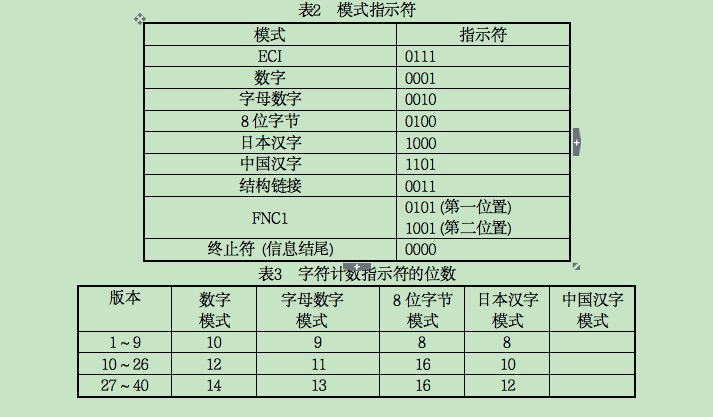
        > 
        > 整个符号的结束由4位终止符0000表示,当符号数据位流后所余的容量不足4位时,
        > 终止符江北截断.终止符本身不是模式指示符.
        >
        > 本模式用于按可选的字节值解释(例如不同的字符集)对某类数据进行编码,可选的
        > 字节值的解释应符合AIM ECI规范中对该类数据进行预处理的规则.模式用模式指示符0111引入.
        > 不需要引入QR码缺省扩充解释(ECI头000020,对应于JIS8转换JIS字符集),尤其是在任何符号的开始.
        > 
        > ECI只能用于识读器可以传送符号标识的情况,不能传送符号标识的识读器无法从
        > 包含ECI的符号中传输数据.
        >
        > 输入的ECI数据需要编码系统作为一系列8位字节值进行处理.
        >
        > ECI序列中的数据可以一种或几种模式对其字节进行最高效编码,而不必考虑其实际意义.
        > 例如:值为0x30-0x39的数据序列可以当做一个数字0-9序列,用数字模式进行编码(见8.4.2),
        > 即使也许实际上它并不表示数字数据.字符计数指示符由字节的数量决定.
        > (在日本汉字模式中为双字节、中国汉字模式中为双字节)
        - 8.4.1.1 ECI 指示符
        > 每个扩充解释被分配一个6位的任务号,它为紧接在QR符号的ECI模式指示符后面的1个、2个或3个码字.
        > 其编码规则见表4.ECI模式指示符编码为ASCII/JIS8字符0x5C(\或ISO 646 IRV中的反斜线,
        > ￥或JIS8中的日圆符号),其后紧随6位任务号.
        > 如果ASCII/JIS8字符0x5C 本身是作为数据的内容，在应用ECI协议的符号中编码前，应在数据串中重复该字符。
        >
        > 
        >
        > 在解码译码时，第一个ECI指定符码字（ECI模式中模式指示符后的码字）的二进制图形，
        > 确定ECI指定符序列的长度。第一个“0”前面的“1”的个数量表示ECI任务号
        > 的第一个码字后的附加码字的数量。第一个“0”后面的各位，是ECI任务号的二进制表示。
        > 较低的ECI任务号有多种编码方式，最短的方式为首选的。
        > 
        > 例如：假设编码的数据为希腊字母，字符集为ISO 8859-7（ECI000009），符号版本为1-H。 
        > 要编码的数据：	(字符值 0xA1, 0xA2, 0xA3, 0xA4, 0xA5)  
        > 符号中的位序列：                                               
        > ECI模式指示符	0111                                          
        > ECI任务号（000009）	00001001                                  
        > 模式指示符（8位字节）	0100                                      
        > 字符计数指示符（5）	00000101                                  
        > 数据：	10100001 10100010 10100011 10100100 10100101          
        > 最终的位串：	0111 00001001 0100 00000101 10100001 10100010     
        >           10100011 10100100 10100101                        
        > 该数据译码后传送的例子见15.2节。                                 
        - 8.4.1.2 多种ECI
        > 请参阅AIM ECI规范中规定的ECI数据段中有关ECI指定符的作用的规则。
        > 例如，已经应用某一字符集ECI的数据也可用一个与初始的ECI共存的
        > 非字符集ECI加密或压缩，或者第二个ECI可以取消第一个ECI并开始一个新的ECI段。
        > 在数据中出现任何ECI指定符都要按8.4.1.1在QR码符号中编码并开始一个新的模式段。
        - 8.4.1.3 ECI和结构链接
        > 引入任何ECI,必须遵从上述规则及AIM的ECI规范,直到编码数据的结束或者出现
        > 另一个ECI（由模式指示符0111表示）。如果ECI编码的数据以结构链接的模式延伸到
        > 两个或更多的符号，那么，在每一个继续使用该ECI模式的后续符号中,需提供一个由
        > ECI模式提示符和ECI指定符组成的ECI标头,该标头紧跟在结构链接头之后。
    - 8.4.2 数字模式
        > 将输入的数据每三位分为一组，将每组数据转换为10位二进制数。如果所输入的数据
        > 的位数不是3的整数倍，所余的1位或2位数字应分别转换为4位或7位二进制数。
        > 将二进制数据连接起来并在前面加上模式指示符和字符计数指示符。数字模式中字符计数
        > 指示符如表3中定义的有10、12或14位。输入的数据字符的数量转换为10、12或14位二进制数后，
        > 放置在模式指示符之后，二进制数据序列之前。
        >
        > 例1 （符号版本1-H）
        > 输入的数据：	01234567                                         
        > 1) 分为3位一组：	012 345 67                                   
        > 2) 将每组转换为二进制：	012→0000001100                       
        >                       345→0101011001                       
        >                       67 →1000011                          
        > 3) 将二进制数连接为一个序列：0000001100 0101011001 1000011      
        > 4) 将字符计数指示符转换为二进制（版本1-H为10位）：                 
        >                       字符数为：8→0000001000                 
        > 5) 加入模式指示符0001以及字符计数指示符的二进制数据：               
        >   0001 0000001000 0000001100 0101011001 1000011            
        > 例2 （符号版本1-H）                                           
        > 输入的数据：	0123456789012345                                 
        > 1) 分为3位一组：	012 345 678 901 234 5                        
        > 2) 将每组转换为二进制：	012→0000001100                       
        >                       345→0101011001                       
        >                       678→1010100110                       
        >                       901→1110000101                       
        >                       234→0011101010                       
        >                       5	→0101                            
        > 3) 将二进制数连接为一个序列：                                   
        >       0000001100 0101011001 1010100110 1110000101 0011101010 0101  
        > 4) 将字符计数指示符转换为二进制（版本1-H为10位）：                 
        >       字符数为：16→0000010000                                
        > 5) 加入模式指示符0001以及字符计数指示符的二进制数据：               
        > 0001 0000010000 0000001100 0101011001 1010100110 1110000101 0011101010 0101  
        > 数字模式中位流的长度计算公式如下：                               
        >   B = 4 + C + 10（D DIV 3） + R                             
        > 其中：B=位流的位数                                            
        > C=字符计数指示符的位数（根据表3）                                
        > D=输入的数据字符数                                             
        > R=0 当（D MOD 3）=0                                         
        > R=4 当（D MOD 3）=1                                         
        > R=7 当（D MOD 3）=2                                         
    - 8.4.3 字母数字模式
        > 按照表5，每个输入的字符赋于一个数值V，它的值为0到44。
        > 
        > 将输入的数据分为两个字符一组，用11位二进制表示。将前面字符的值乘以45与第二个字符的值相加，
        > 将所得的结果转换为11位二进制数。如果输入的数据的字符数不是2的整数倍，
        > 将最后一个字符编码为6位二进制数。将所得的二进制数据连接起来并在前面加上模式指示符和字符
        > 计数指示符，按表3的规定在字母数字模式中，字符计数指示符的长度为9、11或13位，其定义见表3。
        > 将输入的字符数编码为9、11或13位二进制数，放在模式指示符之后，二进制数据序列之前。
        > 
        > 例（符号版本1-H）                                          
        > 输入的数据：	AC-42                                         
        > 1）根据表5查出字符的值：	AC-41→（10，12，41，4，2）           
        > 2）将结果分为2个一组：	（10，12）（41，4）（2）              
        > 3）将每组数据转换为11位二进制数：	（10，12）10*45+12→462→00111001110  
        >       （41，4）41*45+4→1849→11100111001                   
        >       （2）→2→000010                                      
        > 4）二进制数据顺次连接：	00111001110 11100111001 000010     
        > 5）将字符计数指示符转换为二进制（版本1-H为9位）                  
        >       输入的字符数	5→000000101                            
        > 6）在二进制数据前加上模式指示符0010和字符计数指示符：             
        >       0010 000000101 00111001110 11100111001 000010      
        > 字母数据模式的二进制位流位数由下式计算：                         
        >       B＝4＋C＋11（D DIV 2）＋6（D MOD 2）                  
        > 其中：B=位流的位数                                          
        > C=字符计数指示符的位数（根据表3）                              
        > D=输入的字符数                                              
    - 8.4.4 8位字节模式
        > 在本模式中，一个8位码字直接表示一个输入数据字符的JIS8字符值，
        > 即密度为每个字符8位，如表6所示。在非缺省的其它ECI中，它直接表示一个8位字节的值。
        > 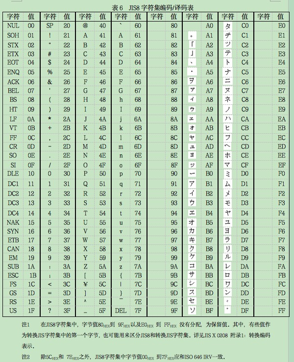
        > 将二进制数据连接起来并在前面加上模式指示符和字符计数指示符。
        > 按表3的规定，8位字节模式的字符计数指示符为8位或16位，将输入字符数转换为
        > 8位或16位二进制数据放在模式指示符之后，二进制数据序列之前。        
        > 8位字节模式的位流的位数计算公式如下：                          
        >       D = 4 + C + 8D                                    
        > 其中：B=位流的位数                                         
        >      C=字符计数指示符的位数（见表3）                         
        >      D=输入数据的字符数                                    
    - 8.4.5 日本汉字模式
        > 在转换JIS系统中，两个字节表示一个日本汉字字符。字节的值由JIS X 0208的值转换而来。
        > 详见JIS X 0208 附录1——“编码字符的表示”。将输入数据字符按下面定义转换为13位二进制码字。
        > 随后将二进制数据连接起来并在前面加上模式指示符和字符计数指示符。
        > 日本汉字模式的字符计数指示符的位数按表3规定为8、10或12位，将字符计数指示符转换为相应的
        > 8、10或12位二进制数，放在模式指示符之后，二进制数据序列之前。
        > - 1． 对于转换JIS值为0x8140 到 0x9FFC之间的字符：
            > a)将转换JIS值减去0x8140；
            > b)将高位字节乘以0xC0；
            > c)将b的结果加上低位字节；
            > d)将结果转换为13位二进制串。
        > - 2． 转换JIS值为0xE040 到0xEBBF之间的字符：
            > a）将转换JIS值减去0xC140；
            > b）将高位字节乘以0xC0；
            > c) 将b的结果加上低位字节；
            > d）将结果转为13位二进制串。
            > 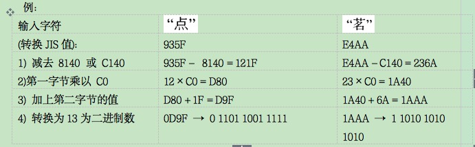
        > - 3． 对于所有的字符：
            > e）在输入的数据字符的二进制队列前加上模式指示符（1000）
            > 和字符计数指示符的二进制表示（8，10或12位）；
            > 日本汉字模式的位流的位数由以下公式计算：                   
            >   B = 4 + C + 13D                                  
            > 其中：B=位流的位数                                     
            >      C=字符计数指示符的位数（见表3）                     
            >      D=输入的数据字符数                                
    - 8.4.6 中国汉字模式
    - 8.4.7 混合模式
        > 根据数据内容的要求或者为了增加编码密度，可以从一种模式转换到另一种模式来表示数据，
        > 详见附录H。每一段数据按8.4.1到8.4.5中给出的相应模式进行编码。
        > 基本结构为模式指示符/字符计数指示符/数据，其后紧跟下一段的模式指示符开始另一段。
        > 图10为有N段数据的结构。
        > 
    - 8.4.8 FNC1模式
        > 有两种模式指示符，它们和8.3.1至8.3.8以及8.4.1至8.4.6规定的模式标志结合起来应用，
        > 标识表示按特定的行业或应用的格式化的信息的符号，
        > 它们（和有关的参数数据一起）放在模式指示符之前。如果使用FNC1模式，
        > 译码器必需按15.1和附录F中的规定传输符号标识符。
        > - 8.4.8.1 FNC1在第一位置
            > 该模式指示符标识表示按UCC/EAN应用标识标准格式化信息的符号。因此，它在符号中只用一次，
            > 并总是放在用于高效对数据进行编码的第一个模式指示符（数字，字母数字，8位字节
            > 或日本汉字、中国汉字）之前，ECI或者结构链接头之后。在UCC/EAN规范中要求FNC1字符
            > （在使用这一特殊字符的其它码制中）用作数据段分隔（即在可变长度数据段的末尾）时，
            > QR码符号将在字母数字模式中用%字符，在8位字节模式中用字符GS（ASCII/JIS8值29）
            > 实现这一功能。如果在数据中也有%符号出现，则应按%%进行编码。译码器在这些符号中遇到%时，
            > 应按ASCII/JIS8值29进行传输；如果遇到%%，则按单个%字符传输。              
            > 例                                                               
            > 输入的数据:                                                       
            > 0104912345123459 （应用标识符01=UCC/EAN物品编码，定长；数据04912345123459）  
            > 15970331（应用标识符15=保质期，格式YYMMDD，定长；数据1997年3月31日）         
            > 30128（应用标识符30=数量，不定长；数据128）（需要分隔符）                 
            > 10ABC123（应用标识符10=批号，不定长；数据ABC123）                      
            > 数据编码为：049123451234591597033130128%10ABC123                   
            > 符号中的位序列：                                                    
            > 0101（模式指示符，意指FNC1在第一位置）                                
            > 0001（模式指示符，数字模式）                                         
            > 0000011101（字符计数指示符，29）                                     
            > <数据：049123451234591597033130128>                               
            > 0010（模式指示符，字母数字模式）                                     
            > 000001001（字符计数指示符，9）                                       
            > <数据：%10ABC123>                                                 
            > 传送的数据（见15.1节和附录F）                                        
            > ]Q301049123451234591597033130128<ASCII 29>10ABC123              
            > 带有%的数据的编码与传送实例：                                         
            > 输入的数据：123%                                                     
            > 编码为：123%%                                                      
            > 传送为：123%
        > - 8.4.8.2 FNC1在第二位置
            > 该模式指示符标识表示按AIM同意的特定行业或者特定应用规范格式化信息的符号。
            > 在它后面跟着一个一字节的码字，该码字的值是用于标识AIM认可的规范中的应用指示符的值。
                    > 在这种情况下，它在符号中只使用一次，并总是放在用于高效对数据进行编码的第一个模式指示符
                    > （数字，字母数字，8位字节或日本汉字、中国汉字）之前，ECI或者结构连接头之后。
                    > 应用指示符可以采用字符集（a-z ，A-Z）中任何一个拉丁字母（用字符的ASCII值加100）
                    > 或者用一个两位数（直接用它的值）表示，并由译码器作为数据前的一个或两个字符传输。
                    >
                    > 例：（本例中的应用指示符37在本规范发布时还没有分配给任组织，本例中的数据内容纯粹是任意的） 
                    > 应用指示符：37
                    > 输入的数据： AA1234BBB112text text text text<CR>                     
                    > 符号中的位序列：                                                       
                    > 1001（模式指示符，意指FNC1在第二位置）                                    
                    > 00100101（应用指示符，37）                                             
                    > 0010（模式指示符，字母数字模式）                                         
                    > 000001100（字符计数指示符，12）                                        
                    > <数据位：AA1234BBB112>                                               
                    > 0100（模式指示符，8位字节模式）                                         
                    > 00010100（字符计数指示符，20）                                         
                    > <数据位：text text text text<CR>>                                    
                    > 传送的数据：]Q537 AA1234BBB112text text text text<CR>                 
            - 8.4.9 终止符
                > 符号的数据结尾由紧跟在最后一个模式段后面的终止符序列0000表示，当数据位流数量正好填满符号的容量时，
                > 它可以省略，或者当符号所余的容量不足4位时它可以截短。
            - 8.4.10 位流到码字的转换
                > 每个模式段的位流需要按顺序连接在一起，最后添加终止符，除非数据位流正好填满符号容量。
                > 所得的数据位流将被分为一个个码字；所有的码字的长度都是8位，如果位流长度最后一个码字不足8位，
                > 则用二进制值为0的填充位填充至8位，填充位应加在数据位流最后1位（最低位）的后面。
                > 然后按表7至11所定义的版本和纠错等级交替添加填充码字11101100和00010001，将数据位流扩展，
                > 以填满符号的数据容量，所得结果的数据码字序列按8.5节进行处理加入纠错码字。
                > 为了正好填满符号容量，有些版本也许需要在信息的最后添加3、4或7个剩余位（全为0），见表1。
                > 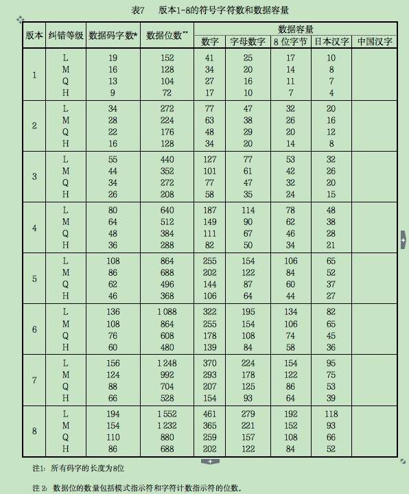
                > 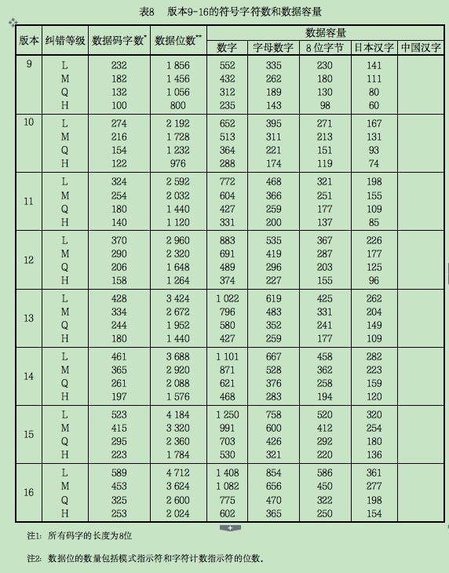
                > 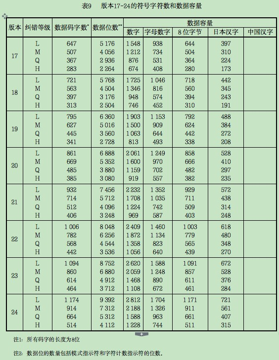
                > 
                > 
        - 8.5 纠错
            - 8.5.1 纠错容量
                > QR码采用纠错算法生成一系列纠错码字，添加在数据码字序列后，使得符号可以在遇到损坏时不致丢失数据。
                > 纠错共有4个纠错等级，对应四种纠错容量，如表12所示。
                > 
                > 纠错等级的选择参见附录I.3
                >
                > 纠错码字可以纠正两种类型的错误，拒读错误（错误码字的位置已知）
                > 和替代错误（错误码字位置未知）。一个拒读错误是一个没扫描到或无法译码的符号字符，
                > 一个替代错误是错误译码的符号字符。由于QR码是矩阵型符号，如果一个缺陷使深色模块变
                > 成浅色模块或将浅色模块变成深色模块，将符号字符错误地译码为表面上有效，但却是
                > 另一个不同的码字。这种数据替代错误需要两个纠错码字来纠正。
                > 
                > 可纠正的替代和拒读错误的数量由下式给出：                               
                >       e + 2t ≤ d – p                                           
                > 其中：e=拒读错误数                                                 
                >      t=替代错误数                                                 
                >      d=纠错码字数                                                 
                >      p=错误译码保护码字                                            
                > 例如：版本6-H符号中共有172个码字，其中有112个纠错码字（其余60个为数据码字）。
                > 这112个纠错码字可纠正56个替代错误或112个拒读错误，即符号纠错容量为56/172或32.6%。
                >
                > 在上面的公式中，版本1-L符号的p=3，版本1-M符号和版本2-L符号的p=2，
                > 版本1-H、1-Q和3-L符号的p=1，其他情况下p=0。p>0（即1，2或3）时，
                > 有p个码字作为错误检测码字，防止从错误超过纠错容量的符号传输数据。e必须小于d/2。
                > 例如，在版本2-L符号中码字总数为44，其中数据码字为34个，纠错码字为10个。
                > 从表13中可以看出纠错容量为4个替代错误（e=0）。代入上面公式：              
                >   0 +（2×4）= 10 – 2                                             
                > 这就意味着纠正4个替代错误只需要8个纠错码字，
                > 剩余的2个纠错码字可用于检测（不能纠正）其他错误，如果超过4个替代错误，则译码失败。
                >
                > 根据版本和纠错等级，将数据码字序列分为1个或多个块，对每一个块分别进行纠错运算。表13-22列出了每个版本、
                > 每个纠错等级的码字总数、纠错码字总数以及纠错块的结构和数量。
                >
                > 如果某一符号版本需要剩余位填充符号容量中剩余的模块，剩余位都应为0。
                > 
                > 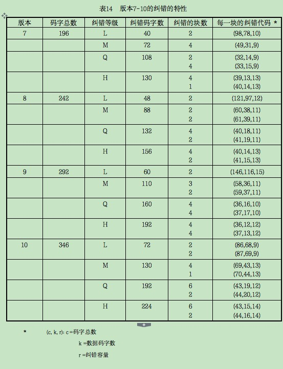
                > 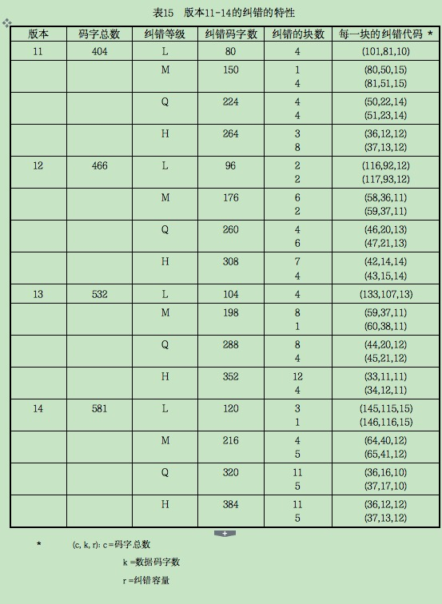
                > 
                > 
                > 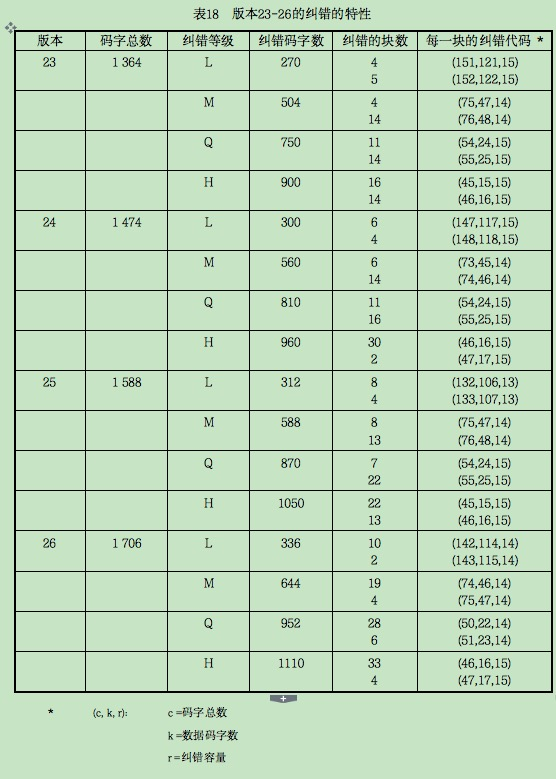
                > 
                > 
                > 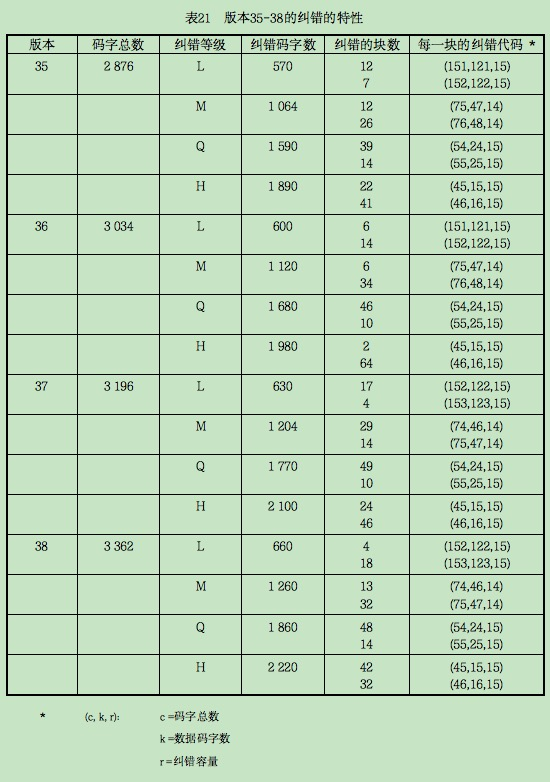
                > 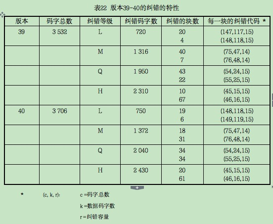
            - 8.5.2 纠错码字的生成
                > 将数据码字（必要时包括填充码字在内）按照表13～22分为相应数量的块，每一块分别计算出纠错码字并添加到数据码字后。
                >
                > QR码的多项式算法用位的模2算法和字节的模100011101算法。这是加罗瓦域28以100011101表示主模块多项式：X8+X4+X3+X2+1。
                >
                > 数据码字为多项式各项的系数，第一个数据码字为最高次项的系数，最低次项的系数是第一个纠错码字前的最后一个数据码字。
                > 
                > 纠错码字是数据码字被纠错码多项式g(x)除得的余数（见附录A）。余数的最高次项系数为第一个纠错码字，最低次项系数为最后一个纠错码字，也是整个块的最后一个码字。
                >
                > 用于生成纠错码字的多项式有31个，在附录A.1中列出。
                > 
                > 纠错算法可以用图11所示的除法电路来实现。寄存器b0 到bk-1的初始值为0。
                > 生成编码的状态有两个，在第一种状态，开关位置向下，数据码字同时经过电路以及输出，
                > 第一种状态在n个时钟脉冲后结束；在第二种状态（n+1…n+k时钟脉冲），开关位置向上，
                > 通过保持输入为0顺序释放寄存器而生成纠错码字ξk-1 ... ξ0 
                > 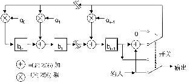
            - 8.6 构造信息的最终码字序列
                > 最终码字序列中的码字数应总是与表7 - 12和表12 - 22所列的符号能够表示的码字总数相同。
                >
                > 按如下步骤构造最终的码字序列（数据码字加上纠错码字，必要时加上剩余码字）。
                > 1）按表13-22，根据版本和纠错等级将数据码字序列分为n块。                    
                > 2）对每一块，按照8.5.2和附录A计算相应块的纠错码字。                       
                > 3）依次将每一块的数据和纠错码字装配成最终的序列：数据块1的码字1；数据块2的码字1；
                > 数据块3的码字1；以此类推至数据块n-1的最后的码字；数据块n的最后的码字；随后，纠错块1的码字1，
                > 纠错块2的码字1，…以此类推至纠错块n-1的最后的码字；纠错块n的最后的码字。
                > QR码符号所包含的数据和纠错块通常正好填满符号的码字容量，而在某些版本中，也许需要3、4
                > 或7个剩余位，添加在最终的信息位流中以正好填满编码区域的模块数。               
                > 最短的数据块应在序列的最前面，所有的数据码字在第一个纠错码字的前面。
                > 例如，版本5-H的符号由4个数据和纠错块组成，前两个块分别包括11个数据码字和22个
                > 纠错码字，第3、4个块分别包括12个数据码字和22个纠错码字。在此符号中，
                > 字符的布置如下，表中的每一行对应一个块的数据码字（表示为Dn）和相应块的纠错码字
                > （表示为En）；符号中字符的布置可以通过由上向下逐列读表中的各列得到。
                > 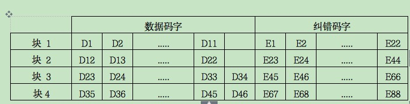
                > 版本5-H符号的最终码字序列为：                                           
                > D1, D12, D23, D35, D2, D13, D24, D36, ... D11, D22, D33, D45,
                > D34, D46, E1, E23, E45, E67, E2, E24, E46, E68, ... E22, E44, 
                > E66, E88。如果需要，在最后的码字后面加上剩余位（0）。
            - 8.7 码字在矩阵中的布置
                - 8.7.1 符号字符表示
                > 在QR码符号中有两种类型的符号字符：规则的和不规则的。
                > 它们的使用取决于它们在符号中的位置，以及与其他符号字符和功能图形的关系。
                > 
                > 多数码字在符号中表示为规则的2×4个模块的排列。其排列有两种方式，
                > 垂直布置（2个模块宽，4个模块高）；如果需要改变方向，可以水平布置
                > （4个模块宽，2个模块高）。当改变方向或紧靠校正图形或其他功能图形时，
                > 需用不规则符号字符。
                - 8.7.2 功能图形的布置
                > 按照与使用的版本相对应的模块数构成空白的正方形矩阵。
                > 在寻象图形、分隔符、定位图形以及校正图形相应的位置，填入适当的深色浅色模块。
                > 格式信息和版本信息的模块位置暂时空置，其具体位置见图15和16，
                > 它们对所有版本都是相同的。附录E定义了校正图形的位置。
                - 8.7.3 符号字符的布置
                > 在QR符号的编码区域中，符号字符以2个模块宽的纵列从符号的右下角开始布置，并自右向左，
                > 且交替地从下向上或从上向下安排。下面给出了符号字符以及字符中位的布置原则。
                > 图15、16为使用这些规则的版本2和版本7的符号。
                > a)位序列在纵列中的布置为从右到左，向上或向下应与符号字符的布置方向一致。
                > b)每个码字的最高位（表示为位7）应放在第一个可用的模块位置，以后的放在下一
                > 个模块的位置。如果布置的方向是向上的，则最高位占用规则模块字符的右下角的模块，
                > 布置的方向向下时为右上角。如果先前的字符结束于右侧的模块纵列，
                > 最高位可能占据不规则符号字符的左下角模块的位置（见图14）。
                > 
                > c)如果符号字符的两个模块纵列同时遇到校正图形或定位图形的水平边界，
                > 可以在图形的上面或下面继续布置，如同编码区域是连续的一样。
                > d)如果遇到符号字符区域的上或下边界（即符号的边缘，格式信息，
                > 版本信息或分隔符），码字中剩余的位应改变方向放在左侧的纵列中。
                > 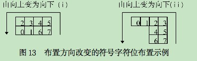
                > e)如果符号字符的右侧模块纵列遇到校正图形或版本信息占用的区域，位的布置形成不规则排列符号字符，
                > 在相邻校正图形或版本信息的单个纵列继续延伸。
                > 如果字符在可用于下一个字符的两列纵列之前结束，则下一个符号字符的首位放在单个纵列中。
                > 
                > 还有另一种可供选择的符号字符布置方法，可得到相同的结果，将整个码字序列视为一个单独的位流，
                > 将其（最高位开始）按从右向左，按向上和向下的方向交替的布置于两个模块宽的纵列中。
                > 并跳过功能图形占用的区域，在纵列的顶部或底部改变方向，每一位应放在第一个可用的位置。
                >
                > 当符号的数据容量不能恰好分为整数个8位符号字符时，要用相应的剩余位（如表1中所示的3，4或7）
                > 填充符号的容量。在根据8.8节进行掩模以前，这些剩余位的值为0。
                > 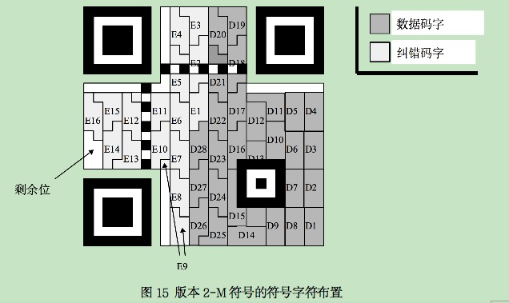
                > 
            - 8.8 掩模
                > 为了QR码阅读的可靠性，最好均衡地安排深色与浅色模块。应尽可能避免位置探测图形的
                > 位图1011101出现在符号的其他区域。为了满足上述条件，应按以下步骤进行掩模。
                > 1)掩模不用于功能图形
                > 2)用多个矩阵图形连续地对已知的编码区域的模块图形（格式信息和版本信息除外）进行XOR操作。XOR操
                > 作将模块图形依次放在每个掩模图形上，并将对应于掩模图形的深色模块的模块取反（浅色变成深色，或相反）。
                > 3)对每个结果图形的不合要求的部分记分，以评估这些结果。
                > 4)选择得分最低的图形。
                - 8.8.1 掩模图形
                > 表23给出了掩模图形的参考（放置于格式信息中的二进制参考）和掩模图形生成的条件。
                > 掩模图形是通过将编码区域（不包括为格式信息和版本信息保留的部分）内那些条件为
                > 真的模块定义为深色而产生的。所示的条件中，i代表模块的行位置，j代表模块的列位置，
                > （i,j）=(0,0)代表符号中左上角的位置。
                > 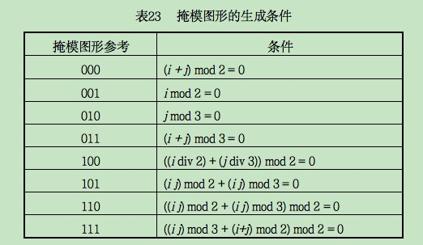
                > 图17给出了版本1符号的所有的掩模图形，图18模拟了用掩模图形参考000到111的掩模结果。
                > 
                > 
                - 8.8.2 掩模结果的评价
                > 在依次用每一个掩模图形进行掩模操作之后，要通过对每一次如下情况的出现进行罚点记分，
                > 以便对每一个结果进行评估，分数越高，其结果越不可用。在表24中，
                > N1到N4为对不好的特征所罚分数的权重（N1=3，N2=3，N3=40，N4=10），
                > i为紧邻的颜色相同模块数大于5的次数，k为符号深色模块所占比率离50%的差距，
                > 步长为5%。虽然掩模操作仅对编码区域进行，不包括格式信息，但评价是对整个符号进行的。
                > 
                > 应选择掩模结果中罚分最低的掩模图形用于符号掩模。
            - 8.9 格式信息
                > 格式信息为15位，其中有5个数据位，10个是用BCH（15，5）编码计算得到的纠错位。
                > 有关格式信息纠错计算的详细内容见附录C。第一、二数据位是符号的纠错等级，见表25。
                > 
                > 格式信息数据的第3到第5位的内容为掩模图形参考，见表23，按8.8.2进行图形的选择。
                >
                > 按附录C的方法计算10位纠错数据，并加在5个数据位之后，。
                > 
                > 然后，将15位格式信息与掩模图形101010000010010进行XOR运算，以确保纠错等级和掩模图形合在一起的结果不全是0。
                > 
                > 格式信息掩模后的结果应映射到符号中为其保留的区域内，见图19。需要注意的是，
                > 格式信息在符号中出现两次以提供冗余，因为它的正确译码对整个符号的译码至关重要。
                > 图19中，格式信息的最低位模块编号为0，最高位编号为14，位置为（4V+9，8）
                > 的模块总是深色，不作为格式信息的一部分表示，其中V是版本号。
                > 例：                                                         
                > 设定纠错等级为M：	00                                        
                > 掩模图形参考：	101                                           
                > 数据：	00101                                                 
                > BCH位：	0011011100                                        
                > 掩模前的位序列：	001010011011100                               
                > 用于XOR操作的掩模图形：	101010000010010                       
                > 格式信息模块图形：	100000011001110                           
                > 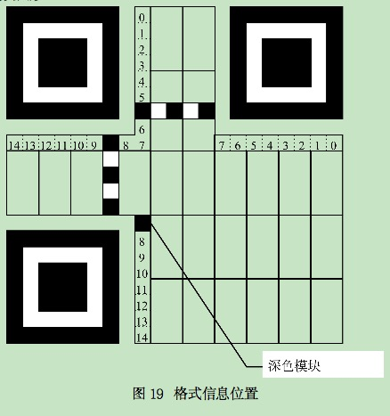
            - 8.10 版本信息
                > 版本信息为18位，其中，6位数据位，通过BCH（18，6）编码计算出12个纠错位。版本信息纠错位计算的详细信息见附录D。
                > 6位数据为版本信息，最高位为第一位。
                >
                > 12位纠错信息在6位数据之后，其计算方法见附录D。
                > 只有版本7～40的符号包含版本信息，没有任何版本信息的结果全为0。所以不必对版本信息进行掩模。
                > 最终的版本信息应映射在符号中预留的位置，见图20。需要注意的是，由于版本信息的正确译码是整个符号正确译码的关键，
                > 因此版本信息在符号中出现两次以提供冗余。版本信息的最低位模块放在编号为0的位置上，最高位放在编号为17的位置上，见图21。
                > 
                > 例：                                                         
                > 版本号：	7                                                 
                > 数据：	000111                                                
                > BCH位：	110010010100                                      
                > 格式信息模块图形：	000111110010010100                        
                > 6行×3列模块组成的版本信息块放在定位图形的上面，其右侧紧临右上角位置探测图形的分隔符，
                > 3行×6列模块组成的版本信息块放在定位图形的左侧，其下边紧临左下角位置探测图形的分隔符。
                > 
                > 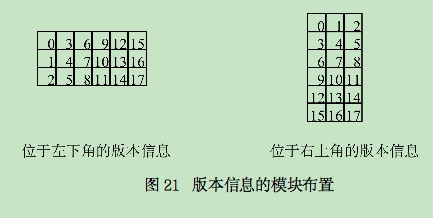
                
### 9结构链接
- 9.1 基本原则
> 可将多达16个QR码符号以一定的结构方式链接起来，
> 如果一个符号是一个结构链接信息的一部分，那么，它用位于最前边的三个符号字符组成的标头来指示。
>
> 结构链接模式指示符0011放在第一个符号字符中的四个高位。
>
> 结构链接模式指示符之后，紧接两个结构链接码字，它们分布在第一个符号字符的四个低位、
> 第二个符号字符的八位以及第三个符号字符的四个高位。第一个码字是符号序列指示符，
> 第二个码字是奇偶校验数据，它在结构链接信息的所有同一链接的QR码符号中是相同的，
> 用以确认所有阅读的符号是同一结构链接信息的一部分。结构链接头后紧接以第一个模式指示符开始的符号的数据码字。
> 如果采用ECI缺省模式之外的一个或多个ECI模式，那么，每一个由ECI模式指示符与ECI模式指定符组成
> 的ECI标头应紧接在结构链接头后。
>
> 图22中的下半部分给出一个结构链接符号的示例，它与图22中上半部分的QR符号表示相同的数据信息。
> 
- 9.2 符号序列指示符
> 此码字表示每一符号在以结构链接方式组成的QR码符号集（可包括多达16个QR码符号）
> 中的的位置（以n个符号中的第m个的形式）。该码字的前四位标识特定符号的位置。
> 后四位标识该结构链接格式中被链接的QR码符号的总数。
> 两个4位图形应分别与（m-1）和（n-1）的二进制值相对应。
>
> 例：                                                                     
> 为表示一个由7个符号组成的符号集中的第3个符号，编码如下：                          
> 第3个位置：	0010                                                          
> 符号总数为7：	0110                                                      
> 字节格式：	00100110                                                      
- 9.3 奇偶性数据
> 奇偶性数据应是跟在符号序列指示符之后的一个8位字节，该奇偶性数据是通过对分成
> 符号块以前的所有原始输入数据的ASCII/JIS值逐字节的进行XOR运算而获得的一个值。
> 模式指示符、字符计数指示符、填充字节、终止符和填充位不包括在计算中。在该运算中，
> 对日本汉字数据用两字节的转换JIS值表示（XOR运算中，每一字节单独进行），对其它字符用
> 表6中的8位JIS值表示。在ECI模式中，应该将在经过数据加密或压缩后获得的8位字节数值用于奇偶性数据的计算。
>
> 例：                                                                     
> 被划分成“0123”，“4567”和“89日本”的“0123456789日本”的奇偶性数据计算如下：        
> 第1个符号块（“0123”）——hex的值30，31，32，33                                
> 第2个符号块（“4567”）——hex的值34，35，36，37                                
> 第3个符号块（“89日本”）——hex的值38，39，93FA，967B                           
> 通过逐字节地对“0123456789日本”数据连续的进行XOR运算计算奇偶性数据信息。            
> 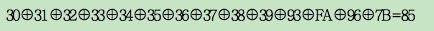
> 特别注意，奇偶性数据计算将根据打印机的容量可在数据被发送到打印机之前或者在打印机中进行。

### 10 符号印制
- 10.1 尺寸
> QR码符号尺寸的确定：                                                        
>       X尺寸：模块宽度将根据应用要求、采用的扫描技术以及符号生成技术来确定。          
>       Y尺寸：模块的高度尺寸必须与模块宽度尺寸相等。                              
>       最小空白区：在符号周围的空白区宽度尺寸为4X
- 10.2 供人识读字符
> 由于QR码符号能包含数千个数据字符，因此供人识读的数据字符包含所有QR码所表示的
> 数据信息是不切实际的。作为一种替代，可用描述性的文本而不是数据原文与符号同时印制在一起。
> 
> 字符尺寸与字体不作具体规定，并且供人识读信息可印制在符号周围的任意区域。但不能影响QR码符号本身及空白区。
- 10.3 符号制作导则
> 可用多种不同的技术印制或标识QR码符号。附录I给出了用户指导。

### 11 符号质量
> 应根据附录K规定的二维矩阵码符号印制质量导则，对QR码符号按如下增加和修正的内容进行质量评估。
- 11.1 获取测试图象
    > 依据附录K.1的要求，用高精度的图像摄像装置获取被测试符号的一个灰度图象，照明光及照射方向由应用决定。
- 11.2 符号质量参数
    - 11.2.1 译码
    > 第13章中的参考译码算法可用于测试图象。如果该符号的整个数据信息能被成功译码，那么译码通过，
    > 译码级别为“4”级（“A”），否则为“0”级（“F”）。
    - 11.2.2 符号对比度
    > 符号对比度分级依据参考译码算法中定义的符号边缘内的测试图象的所有象素
    > （包括4X宽的空白区）的灰度值来进行，具体确定程序见附录K.2.2。
    - 11.2.3 “印制”增量
    > 译码时，译码算法首先建立一个高分辩率的二进制数字化测试图象，然后确定平分符号定位图形
    > 的交替模块的中心线的位置。通过检查穿过交替图形的直线的占空比与50%的差异来评估印制增量。
    > 
    > 取相互独立的两个定位图形（因为水平与垂直增量是有很大差别的），从与每一定位图形相邻的
    > 位置探测图形的外层方块的内边，沿定位图形到与另一位置探测图形相邻接的分隔符的外边，
    > 计算遇到的浅色（NL）与深色（ND）的点阵数。在每一方向上印刷增量的结果度量为：D=ND/（NL+ND），
    > 依据附录K.2.3，按照DNOM=0.50，DMIN=0.35，DMAX=0.65进行印制增量分级。应按沿着垂直与
    > 水平定位图形得到的D值中的较低值进行定级。
    - 11.2.4 轴向不一致性
    > 在测试图象的整个区域中参考译码算法最终生成一个数据模块取样点网格，这些取样点准确的水平与垂直间距是评价轴不一致性的基础。
    >
    > 对相邻数据模块之间的水平和垂直间距分别进行计算。计算它们在整个符号的平均值X_{AVG}和Y_{AVG}。根据它们的
    > 两个平均间距的相互接近程度，按附录K.2.4规定的计算程序对轴向不一致性进行定级。
    - 11.2.5 未使用的纠错
    > QR码采用Reed-Solomon错误控制编码，较小的符号包含单个纠错字段，较大的符号被划分成两个或多个纠错字段。
    > 在所有情况下，应对每一纠错字段按附录K.2.5独立分级，那么未使用纠错分级应为任一字段中最低的值。
    > 然而，该计算不用于格式信息，也不用于版本信息。
    - 11.3 符号的整体分级
    > 一个QR码符号的总体印刷质量分级是上述能达到的5项指标的分级中的最低值。表26汇总了各项测试的定级尺度
    > 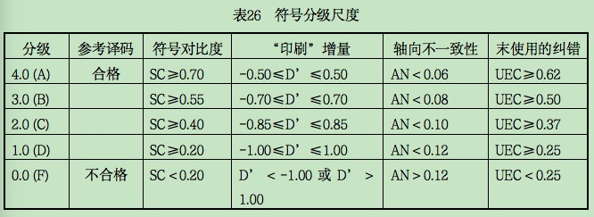
    - 11.4 过程控制测量
    > 有多种工具和方法可以进行有用的测量，对QR码符号生成过程进行检测和控制。它们包括：
    > 1) 用线性条码检测仪测量符号对比度。
    > 2) 用线性条码检测仪对位置探测图形两个轴向的测量，确定水平（与垂直）印制增量。
    > 3) 用物理测量确定轴向不一致性。
    > 4) 用目测检查位置探测图形与定位图形网格的非一致性和缺陷。
    > 每一种工具与方法见附录L。
    
### 12 译码过程
> 从识读一个QR码符号到输出数据字符的译码步骤是编码程序的逆过程，图23为该过程的流程。
> 1) 定位并获取符号图像。深色与浅色模块识别为“ 0”与“1”的阵列。
> 2) 识读格式信息（如果需要，去除掩模图形并完成对格式信息模块的纠错，识别纠错等级与掩模图形参考。）
> 3) 识读版本信息，确定符号的版本。
> 4) 用掩模图形掩模图形参考已经从格式信息中得出对编码区的位图进行异或处理消除掩模。
> 5) 根据模块排列规则，识读符号字符，恢复信息的数据与纠错码字。
> 6) 用与纠错级别信息相对应的纠错码字检测错误，如果发现错误，立即纠错。
> 7) 根据模式指示符和字符计数指示符将数据码字划分成多个部分。
> 8) 最后，按照使用的模式译码得出数据字符并输出结果。
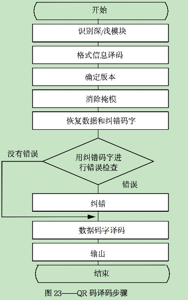

### 13 QR码的参考译码算法
> 参考译码算法在图像中寻找符号并进行译码，译码算法参照图象中的深色浅色状态。
> 1) 选择图象的反射率最大值与最小值之间的中值确定阈值，使用阈值将图象转化为一系列深色与浅色像素。
> 2) 确定寻象图形，在QR码中的寻象图形由位于符号的4个角中的3个角上的3个相同的位置探测图形组成。
> 如7.3.2所述，每一位置探测图形的模块序列由一个深色—浅色—深色—浅色—深色次序构成，
> 各元素的相对宽度的比例是1∶1∶3∶1∶1。对本译码算法，每一元素宽度的允许偏差为0.5
> （即单个模块的方块的尺寸允许范围为0.5～1.5，3个模块宽度的方块的宽度允许尺寸范围为2.5～3.5）。
    > a. 当探测到预选区时，注意图像中一行像素与位置探测图形的外边缘相遇的第一点和最后一点A和B（图24）。
    > 对该图像中的相邻象素行重复探测，直到在中心方块X轴方向所有穿过位置探测图形的直线被全部识别。
    > 
    > b. 重复步骤a，在图象的Y轴方向，识别穿过位置探测图形中心方块的所有象素行。
    > c. 确定探测图形中心，通过在X轴方向穿过位置探测图形中心块的最外层的象素线上A、B
    > 两点连线的中点连一直线，用同样方法在另一垂直方向上划一直线，两条直线的交点就是位置探测图形的中心。
    > d. 重复步骤a至c，确定其它两个位置探测图形的中心位置。
> 3) 通过分析位置探测图形中心的坐标，识别哪一个位置探测图形是左上角图形以及符号的旋转角度来确定符号的方位。
> 4) 确定：a) 距离D，是左上角位置探测图形中心与右上角位置探测图形中心之间的距离，b) 两个探测图形的宽度，W_{UL}和W_{UR}。
> 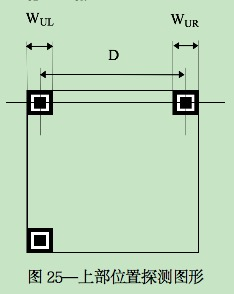
> 5) 计算符号的名义模块宽度尺寸X
>       X=（W_{UL}+W_{UR}）/14
> 6) 初步确定符号的版本
>       V = [(D/X) - 10] / 4
> 7) 如果初步确定的符号版本等于或小于6，那么该计算值即为版本号。如果初步确定的符号版本等于或大于7，
> 那么版本信息应按下列步骤译码：
    > a) 用7除以右上角位置探测图形的宽度尺寸W_{UR}，得到模块尺寸CP_{UR}
    >           CP_{UR}=W_{UR}/7
    > b) 见图26， 由A，B和C找出通过三个位置探测图形中心的导向线AC、AB。根据与导向线相平行的直线、
    > 位置探测图形的中心坐标和模块尺寸CPUR 确定在版本信息1区域中每一模块中心的取样网格。
    > 二进制值0和1根据采样网格上的深色浅色的图形来确定。
    > 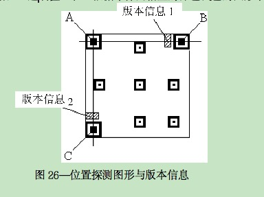
    > c) 通过检测并纠错确定版本，如果有错，根据BCH纠错原理，对版本信息模块出现的错误进行纠错，参见附录D。
    > d) 如果发现错误超过纠错容量，那末计算左下方位置探测图形的宽度尺寸WDL，并按上述步骤a)，b)，c)对版本信息2进行译码。
> 8) 8)对于没有校正图形的版本1符号，继续按照附录M.14中的算法的第7步和第8步进行译码，然后转至本算法的
> 第9步。版本2以及更高版本的符号的译码要求由7.3.5和附录E定义的坐标决定的每一校正图形的中心坐标来确定取样网格。
> 
    > a) 左上角位置探测图形的宽度WUL除以7，计算模块尺寸CP_{UL}
    >           CP_{UL}=W_{UL}/7
    > b) 根据左上角位置探测图形P_{UL}的中心A的坐标，平行于从第7c）得到的导向直线AB和AC的直线
    > 以及模块尺寸CP_{UL}初步确定校正图形P_{1}和P_{2}的中心坐标。
    > c)从初定的中心坐标的象素开始，扫描校正图形P_{1}和P_{2}中的空白方块的轮廓，确定实际的中心坐标X_{i}和 Y_{j}（见图28）
    > 
    > d) 根据左上角位置探测图形P_{UL}的中心坐标和在c)中得到的校正图形P_{1}和P_{2}的实际中心坐标值，
    > 估计校正图形P_{3}的初步中心坐标。
    > e) 按照c)中同样的步骤找到校正图形P_{3}的实际中心坐标。
    > 确定L_{x}和L_{y}，LX是指校正图形P_{2}和P_{3}两中心之间的距离，L_{y}是指校正图形P_{1}和P_{3}两中心之间的距离。
    > 用校正图形的已定义的间距除L_{x}和L_{y}，获得位于符号左上角区域下边的模块节距CP_{x}和右边的模块节距CP_{y}值。
    >           CP_{x}=L_{x}/AP                                                  
    >           CP_{y}=L_{y}/AP                                                  
    > 其中，AP是校正图形中心的模块间距（见表E.1）
    >
    > 以同样方式，找出{L_{x}}^{'}，和{L_{y}}^{'}，，{L_{x}}^{'}，是左上部位置探测图形P_{UL}与校正图形P_{1}的中心坐标之间的水平距离。
    > {L_{y}}^{'}，是左上部位置探测图形P_{UL}的中心坐标与校正图形P_{2}的中心坐标之间的垂直距离。
    > 由下面给出的公式计算符号左上角区域中上边的模块节距CP_{x}和左边的节距{CP_{x}}^{'}，值。
    > 
    > {CP_{x}}^{'}={L_{x}}^{'}/（校正图形P_{1}的中心模块的列坐标 — 左上部位置探测图形P_{UL}的中心模块的列坐标）
    > {CP_{y}}^{'}={L_{y}}^{'}/（校正图形P_{2}的中心模块的行坐标 — 左上部位置探测图形P_{UL}的中心模块的行坐标）
    > 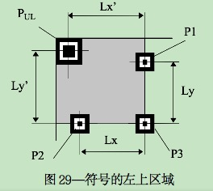
    > g) 依据代表符号左上区的每一边的模块节距值CP_{x}，{CP_{x}}^{'}，CP_{y}和{CP_{y}}^{'}，确定覆盖符号的左上区的采样网格。
    > h) 在同样方式下，确定符号右上区（被右上角位置探测图形P_{UR}，校正图形P_{1}，P_{3}和P_{4}所覆盖）
    > 和符号左下区（被右上区位置探测图形P_{UR}，校正图形P_{2}，P_{3}和P_{5}覆盖）的采样网格。
    > i) 对校正图形P_{6}（见图30），由校正图形P_{3}、P_{4}和P_{5}的间距，穿过校正图形P_{3}和P_{4}，
    > P_{4}和P_{5}的中心的导向直线以及这些图形的中心坐标值得到的模块间距{CP_{x}}^{'}和{CP_{y}}^{'}，值，估计它的初步的中心坐标。
    > 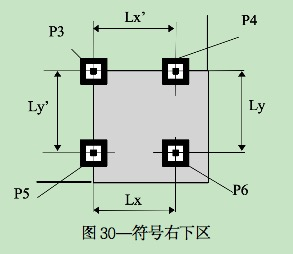
    > j) 重复步骤e)—h)，确定符号右下区的采样网格。
    > k) 用同样原则确定符号未覆盖区的采样网格。
> 9) 对网格的每一交点上的图象象素取样，并根据阈值确定是深色块还是浅色块，构造一个位图，
> 用二进制的“1”表示深色的象素，用二进制的“0”表示浅色的象素。
> 10) 对与左上区位置探测图形相邻的格式信息译码，得到纠错等级和用于符号的掩模图形。
> 如果检测出错误超过格式信息的纠错容量，那么，采用同样的程序对与右上部和
> 左下部位置探测图形相邻的格式信息进行译码。
> 11) 用掩模图形对符号编码区进行异或（XOR）处理，解除掩模并恢复表示数据和纠错码字的符号字符。
> 这与在编码程序中采用的掩模处理过程的作用正好相反。
> 12) 根据8.7.3中的排列规则确定符号码字。
> 13) 根据符号版本和纠错等级需求，用在8.6中第3步规定的交替处理的逆过程，重新将码字序列按块排列。
> 14) 按照附录B中的错误检测与纠错译码程序，纠正替化错误与拒读错误，
> 直到符号版本和纠错等级所规定的最大纠错容量。
> 15) 通过重新组配数据块序列，恢复原始信息的位流。
> 16) 将数据位流分成若干段，每一段由模式指示符开始，段的长度由在模式指标符后的字符计数指示符确定。
> 17) 根据采用的模式的规则，对每一段进行译码。

### 14 自动鉴别能力
> QR码可以与许多其它码制符号一起用于自动识别环境中（见附录J）。
> 除此而外，通过对格式信息掩模图形的分析，可自动识别模式1和模式2符号。
> 设备供应商可提供选择仅对模式1或仅对模式2或对两种模式都可进行译码。

### 15 数据传输
> 所有编码的数据字符都应包括在数据传输之列。功能图形、格式信息与版本信息、纠错字符、填充
> 和剩余字符不传输。所有数据的缺省传输模式是它们的8位JIS8值或16位转换JIS值。
> 由于字符值的设定,它准确地传输数字、拉丁字母、假名、日本汉字和中国汉字数据序列。
> 工作在缓冲模式下的译码器在传输之前将数据文件重新链接，不传输结构链接头。
> 如果译码器在非缓冲模式下工作，结构链接头应作为每个符号的前两个字节进行传输。
> 包含扩展解释的数据传输在内的更复杂的解释将在下面叙述。
- 15.1 符号标识符
    > ISO/IEC 15424提供了一个标准的程序，根据译码器的设置选择和符号的自身特性报告已经阅读的码制。
    >
    > 一旦数据结构（包括使用的ECI模式）被识别，译码器将适当的符号标识符作为一个段首标记追加到被传输的数据上；
    > 如果使用ECI模式，就需要符号标识符。用于QR码的符号标识与选择值见附录F。
- 15.2 扩展解释
    > 在支持ECI协议的系统中，每一传输都要求传输符号标识符。在任何时候遇到ECI模式指示符，
    > 它应作为转义字符0x5C被传输，依据JIS X 0201，
    > 0x5C在QR码的缺省编码中代表字符“¥”（在AIM ECI规范和ASCⅡ字符集中，
    > “¥”字符值对应反斜杠字符“\”）。按照在表4中定义规则的逆运算，表示ECI指示符的码字将转化成一个6位数，
    > 这些6位数将被传输为0x30至0x39之间的相对应的8位值，紧接在转义字符之后。
    >
    > 应用软件识别到\nnnnnn之后,将所有后续字符解释为来自6位数字的指示符定义的ECI。
    > 该解释在下述两种情况出现之前一直有效：
    > a) 编码数据的结束；
    > b) 按AIM ECI规范所定义的规则，通过模式指示符0111表示改变为一个新的ECI。
    > 
    > 当返回到缺省解释方式时，译码器应输出适合的转义序列作为数据的前缀。
    >
    > 如果字符“¥”需要作为被编码的数据，应按如下方式进行传输：每当字符0x5C作为数据出现，
    > 应传输两个该值的字节，因此每当单个值出现，总是一个转义字符，连续两次出现则表示真正的数据。
    > 
    > 例1：                                                                
    >       1) 被编码的数据：	ABC ¥ 1234                                    
    >          被传输的数据：ABC ¥¥ 1234                                     
    >       2) 被编码的数据：ABC后面紧跟按照ECI 123456的规则编码的<后续数据>。     
    >          被传输的数据：ABC ¥ 123456<后续数据>。
    >
    > 例2：（使用8.4.1.1中的数据）                                            
    > 该信息包含：ECI模式指示符、ECI指定符、模式指示符、字符计数指示符以及数据，形式如下： 
    > 0111 00001001 0100 00000101 10100001 10100010 10100011 10100100 10100101  
    > 符号标识符 ]Q2（见附录F）必须附加到数据传输之中。                            
    > 传输（hex值）5D 51 32 5C 30 30 30 30 30 39 A1 A2 A3 A4 A5             
    > 以ECI000009编码的数据ABГ△E                                            
    > 
    > 在结构链接模式中，如果符号的开始就遇到ECI模式指示符，
    > 后续序列数据字符应被解释为当前模式,前一符号的终止端使用的ECI无效。
    > 
    > 注：反斜杠字符“\”，ASCII值0x5C等同于JIS X 0201中的“¥”。
- 15.3 FNC1
    > 在第1或第2个位置隐含FNC1的模式中，由于没有ASCII或JIS8值与该字符相对应，
    > 该隐含字符不能被直接传输。因此必须通过相关符号标识符（）Q3，）Q4，）Q5，）Q6）传输，
    > 指示隐含FNC1出现在第一个或第二个位置。在这些符号的其它位置，依据相关应用规则，
    > FNC1也可作为一个数据字段分隔符出现。在字母数字模中用字符“%”表示；
    > 在8位字节模式中用字符“GS”（ASCII/JIS 8值0x1D）表示。在两种模式中，
    > 译码器应传输ASCII/JIS 8值0x1D。
    >
    > 如果字符“%” 在字母模式中是编码数据的一部分，
    > 它在符号中用“%%”表示，如果译码器遇到这种情况将以单个字符“%”转输。